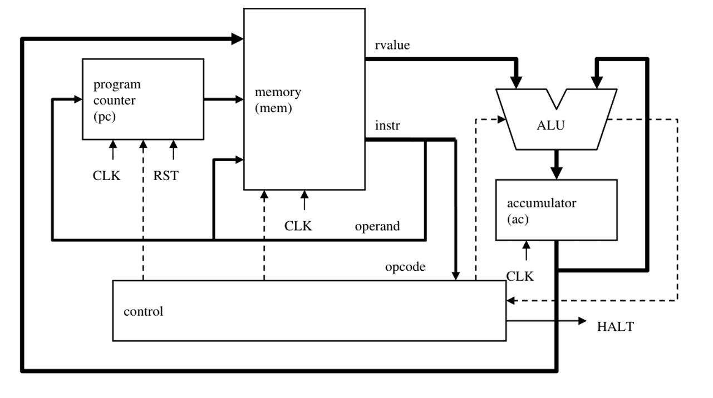

# RISC-CPU-Verilog Project

## Overview
This project implements a RISC CPU in Verilog. The CPU is designed to execute a set of basic instructions, including arithmetic, logical, memory, and control operations. The project includes the CPU design, its components, and testbenches to verify functionality.

## Block Diagram

Below is the block diagram of the RISC CPU:



## Features
- **Instruction Set**: Supports basic instructions such as `LDA`, `ADD`, `AND`, `XOR`, `STO`, `JMP`, `SKZ`, and `HLT`.
- **Components**:
  - Program Counter
  - Instruction Register
  - Accumulator
  - Arithmetic Logic Unit (ALU)
  - Memory Unit
  - Address Multiplexer
  - Controller
- **Testbenches**: Comprehensive testbenches for each module and the entire CPU.

## Project Structure
```
.
├── RTL_Code/                # Contains Verilog source files for the CPU and its components
│   ├── address_mux.v        # Address multiplexer module
│   ├── alu.v                # Arithmetic Logic Unit (ALU) module
│   ├── controller.v         # Controller module
│   ├── memory.v             # Memory module
│   ├── program_counter.v    # Program Counter module
│   ├── register.v           # Register module
│   └── risc_cpu.v           # Top-level RISC CPU module
├── RTL_Test/                # Contains testbenches for the modules
│   ├── address_mux_tb.v     # Testbench for Address Multiplexer
│   ├── alu_tb.v             # Testbench for ALU
│   ├── controller_tb.v      # Testbench for Controller
│   ├── memory_tb.v          # Testbench for Memory
│   ├── program_counter_tb.v # Testbench for Program Counter
│   ├── register_tb.v        # Testbench for Register
│   ├── risc_cpu_tb.v        # Testbench for the entire RISC CPU
│   └── test_case.txt        # All test cases and expected behavior
└── README.md                # Project documentation
```

## Getting Started

### Prerequisites
- **Simulator**: A Verilog simulator such as ModelSim, Xilinx Vivado, or Icarus Verilog.
- **Waveform Viewer**: GTKWave or any other waveform viewer for analyzing simulation results.

### Running the Simulation
1. Open your Verilog simulator.
2. Compile the required Verilog files from the `RTL_Code` directory.
3. Run the testbenches from the `RTL_Test` directory.
4. View the simulation results and verify the outputs with the test cases provided in `test_case.txt`.

### Example
To test the entire CPU:
- Compile `risc_cpu.v` and `risc_cpu_tb.v`.
- Run the simulation for `risc_cpu_tb.v` (You can change the testcase if needed in test_case.txt).
- Verify the output in the console or waveform viewer.

## Instruction Set

| Opcode | Instruction | Description                          |
|--------|-------------|--------------------------------------|
| 000    | HLT         | Halt the CPU                        |
| 001    | SKZ         | Skip next instruction if zero flag  |
| 010    | ADD         | Add memory value to accumulator     |
| 011    | AND         | Logical AND with memory value       |
| 100    | XOR         | Logical XOR with memory value       |
| 101    | LDA         | Load memory value into accumulator  |
| 110    | STO         | Store accumulator value to memory   |
| 111    | JMP         | Jump to specified address           |

## Test Cases
The `test_case.txt` file contains detailed test cases, including:
- Machine code
- Memory initialization
- Expected behavior
- Observed results

# Acknowledgments
This project was developed as part of a course on LSI Logic Design. Special thanks to our instructors for their support and feedback.

# Members
- Member 1: Trịnh Quốc Bảo
- Member 2: Hoàng Văn Huy
- Member 3: Lê Đức Cường
- Member 4: Phan Minh Trọng
- Member 5: Trần Đình Quang

For more details about this project, refer to this slide: [RISC CPU Slide](https://www.canva.com/design/DAGmlGCzJt8/M5n_t_z-Z-l7XvQp2Cf40g/edit?utm_content=DAGmlGCzJt8&utm_campaign=designshare&utm_medium=link2&utm_source=sharebutton)

